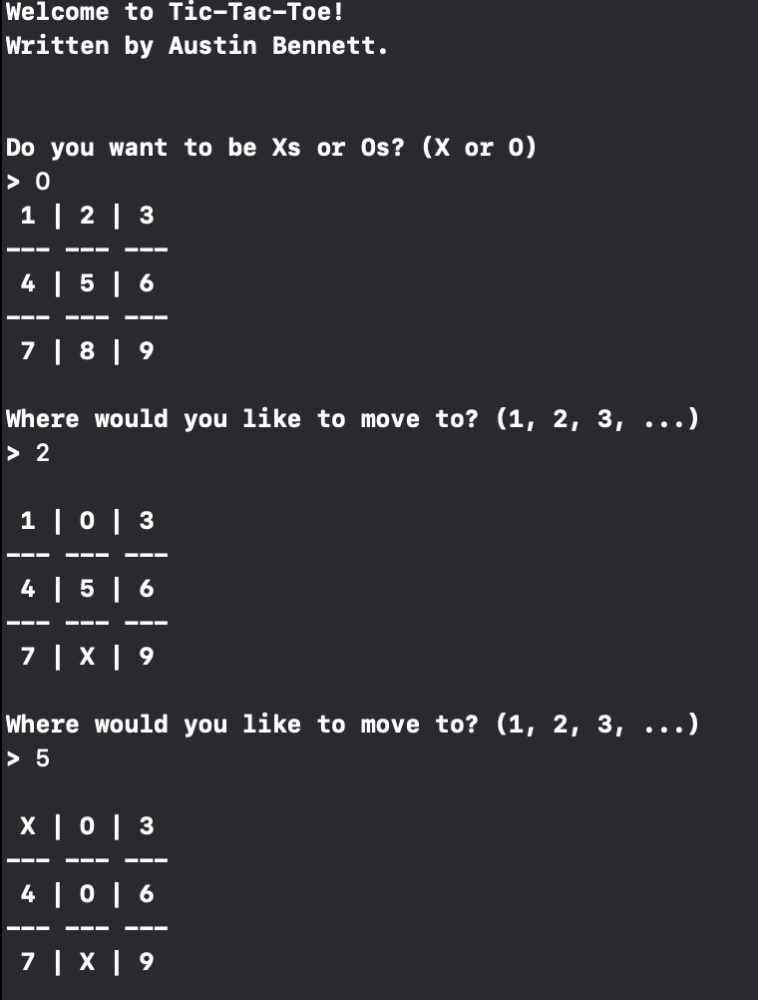

# Tic-Tac-Toe
This is exactly what it looks like, but it’s C++ - developed on MacOS - so how could it go wrong?

## Objective
The sole objective of this is mainly to focus on learning some ground-layer C++ code in order to get me vaguely familiar with the language. Over time, I expect this knowledge-base to grow, but it's a great starting point.

## Example
Below we have a sample run of the application, first we're greeted with a welcome. After the welcome, we jump right into choosing which piece you want to be - for each play through this can be changed during runtime - and then in order to make a move on the board, you're only entering the numeric value for the field you're looking for. There is some safety built-in to prevent generic invalid inputs but don't count solely on that to be perfect (it's pretty good for expected values though).

